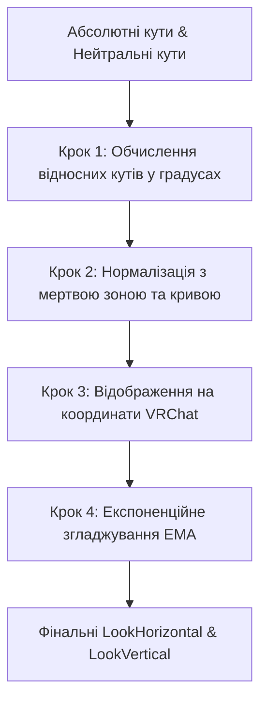
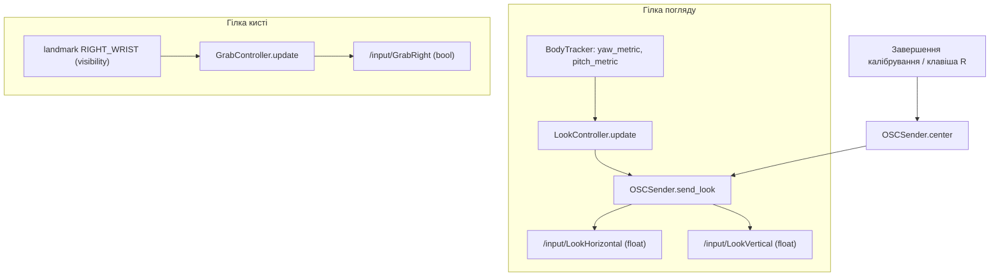

# Документація алгоритмів MediaPipe4VRChat

Цей документ містить покроковий аналіз та математичний опис ключових алгоритмів проекту [MediaPipe4VRChat](file:///C:/Users/User/Yoga/Yoga/MediaPipe4VRChat):
1.  **Відстеження:** Обчислення 3D-орієнтації тулуба ([BodyTracker](file:///C:/Users/User/Yoga/Yoga/MediaPipe4VRChat/body_tracker.py#L71)).
2.  **Логіка керування:** Обробка, фільтрація та відображення кутів у OSC-команди ([LookController](file:///C:/Users/User/Yoga/Yoga/MediaPipe4VRChat/look_controller.py#L87)).

---

## ЧАСТИНА 1. Відстеження 3D-орієнтації тулуба (BodyTracker)

### 1.1. Вхідні дані
Алгоритм використовує координати суглобів із тривимірного простору MediaPipe, представлені об'єктом [Skeleton](file:///C:/Users/User/Yoga/Yoga/MediaPipe4VRChat/pose_types.py#L35):
*   Плечі: $P_{left\_shoulder}$ та $P_{right\_shoulder}$
*   Стегна: $P_{left\_hip}$ та $P_{right\_hip}$

Кожна точка є об'єктом типу [Vector3](file:///C:/Users/User/Yoga/Yoga/MediaPipe4VRChat/math3d.py#L25) з координатами $(x, y, z)$.

### 1.2. Покроковий опис алгоритму відстеження

```mermaid
graph TD
    subgraph Вхідні дані
        S[Ліве/Праве плече]
        H[Ліве/Праве стегно]
    end

    subgraph Крок 1: Розрахунок центрів
        S -->|Середнє значення| SC[Центр плечей C_shoulder]
        H -->|Середнє значення| HC[Центр стегон C_hip]
    end

    subgraph Крок 2: Векторний аналіз
        SC & HC -->|Різниця векторів| VT[Вектор тулуба V_torso]
        S -->|Різниця векторів| VS[Вектор плечей V_shoulder]
        VT -->|Нормалізація| VT_N[Нормалізований вектор тулуба]
        VS -->|Нормалізація| VS_N[Нормалізований вектор плечей]
    end

    subgraph Крок 3: Кути орієнтації
        VS_N -->|yaw = -atan2(x, z)| Yaw[Абсолютний Yaw]
        VT_N -->|pitch = atan2(y, z)| Pitch[Абсолютний Pitch]
    end
```

#### Крок 1: Обчислення центрів плечей та стегон
Для мінімізації локальних коливань обчислюються середні точки:
1.  **Центр плечей** ($\mathbf{C}_{shoulder}$):
    $$\mathbf{C}_{shoulder} = \frac{\mathbf{P}_{left\_shoulder} + \mathbf{P}_{right\_shoulder}}{2}$$
2.  **Центр стегон** ($\mathbf{C}_{hip}$):
    $$\mathbf{C}_{hip} = \frac{\mathbf{P}_{left\_hip} + \mathbf{P}_{right\_hip}}{2}$$

#### Крок 2: Формування та нормалізація напрямних векторів
1.  **Вектор плечей** ($\mathbf{V}_{shoulder}$):
    Напрямок від лівого плеча до правого:
    $$\mathbf{V}_{shoulder} = \mathbf{P}_{right\_shoulder} - \mathbf{P}_{left\_shoulder}$$
    Вектор нормалізується до одиничної довжини:
    $$\mathbf{\hat{V}}_{shoulder} = \text{normalize}(\mathbf{V}_{shoulder})$$
2.  **Вектор тулуба** ($\mathbf{V}_{torso}$):
    Напрямок від центру стегон до центру плечей (вертикальна вісь хребта):
    $$\mathbf{V}_{torso} = \mathbf{C}_{shoulder} - \mathbf{C}_{hip}$$
    Вектор нормалізується:
    $$\mathbf{\hat{V}}_{torso} = \text{normalize}(\mathbf{V}_{torso})$$

#### Крок 3: Обчислення кутів орієнтації (Yaw та Pitch)
*   **Кут повороту (Yaw / Обертання)**:
    Визначає поворот вліво/вправо навколо вертикальної осі. Обчислюється на основі проекцій вектора плечей на горизонтальну площину $(x, z)$:
    $$\text{yaw\_angle} = -\text{atan2}(\mathbf{\hat{V}}_{shoulder}.x, \mathbf{\hat{V}}_{shoulder}.z)$$
    *Примітка:* Знак мінус компенсує дзеркальність камери для системи координат VRChat.
*   **Кут нахилу (Pitch / Тангаж)**:
    Визначає нахил вперед/назад. Обчислюється через проекції вектора тулуба на площину $(y, z)$:
    $$\text{pitch\_angle} = \text{atan2}(\mathbf{\hat{V}}_{torso}.y, \mathbf{\hat{V}}_{torso}.z)$$

---

## ЧАСТИНА 2. Логіка керування (LookController)

Модуль [LookController](file:///C:/Users/User/Yoga/Yoga/MediaPipe4VRChat/look_controller.py#L87) обробляє отримані кути yaw та pitch, 
фільтрує шум і перетворює їх на нормовані значення погляду для VRChat.

### 2.1. Вхідні дані
*   Поточні абсолютні кути тіла: `yaw_angle` та `pitch_angle` (радіани).
*   Відкалібровані нейтральні кути: `neutral_yaw` та `neutral_pitch` (радіани).

### 2.2. Покроковий опис алгоритму керування



#### Крок 1: Обчислення відносних кутів у градусах
Для розрахунків відхилення від нейтрального стану обчислюється різниця кутів та переводиться у градуси:
$$\Delta\theta_{yaw} = \text{degrees}(\text{yaw\_angle} - \text{neutral\_yaw})$$
$$\Delta\theta_{pitch} = \text{degrees}(\text{pitch\_angle} - \text{neutral\_pitch})$$

#### Крок 2: Нормалізація та нелінійна обробка ([normalize_angle](file:///C:/Users/User/Yoga/Yoga/MediaPipe4VRChat/look_controller.py#L131))
Для кожного кута $\theta$ виконуються такі операції:
1.  **Застосування мертвої зони (Dead Zone)**:
    Якщо кут лежить у межах мертвої зони ($|\theta| \le \text{dead\_zone}$), рух ігнорується, і функція повертає $0.0$.
    Якщо кут виходить за межі, мертва зона віднімається для плавного старту:
    $$\theta_{clean} = \theta - \text{dead\_zone} \quad (\text{при } \theta > 0)$$
    $$\theta_{clean} = \theta + \text{dead\_zone} \quad (\text{при } \theta < 0)$$
2.  **Нормалізація**:
    Масштабування кута до діапазону $[-1.0, 1.0]$ на основі максимального робочого діапазону:
    $$\text{normalized} = \frac{\theta_{clean}}{\text{max\_limit} - \text{dead\_zone}}$$
3.  **Обмеження (Clamping)**:
    Значення примусово обмежується в межах $[-1.0, 1.0]$.
4.  **Квадратична характеристика**:
    Для підвищення точності біля центру та чутливості на великих кутах застосовується квадратична крива зі збереженням знаку:
    $$f(x) = \text{sign}(x) \cdot x^2$$

#### Крок 3: Відображення на простір координат VRChat
VRChat приймає значення погляду в діапазоні $[-1.0, 1.0]$, але нейтральне положення зміщене:
*   **Горизонтальний погляд (LookHorizontal)**:
    Центр знаходиться на рівні $0.5$ (при $Y_{norm} = 0$):
    $$H_{target} = 0.5 + 0.5 \cdot Y_{norm} \quad (\text{при } Y_{norm} > 0)$$
    $$H_{target} = -0.5 + 0.5 \cdot Y_{norm} \quad (\text{при } Y_{norm} < 0)$$
*   **Вертикальний погляд (LookVertical)**:
    Центр знаходиться на рівні $0.1$ (при $P_{norm} = 0$):
    $$V_{target} = 0.1 + 0.9 \cdot P_{norm} \quad (\text{при } P_{norm} > 0)$$
    $$V_{target} = -0.1 + 0.9 \cdot P_{norm} \quad (\text{при } P_{norm} < 0)$$

Отримані значення обмежуються функцією `clamp` у межах $[-1.0, 1.0]$.

#### Крок 4: Експоненційне згладжування (EMA)
Для фільтрації тремтіння камери та шумів детекції застосовується експоненційне ковзне середнє з коефіцієнтом згладжування $\alpha = 0.25$:
$$H_{smoothed} = H_{smoothed} + (H_{target} - H_{smoothed}) \cdot 0.25$$
$$V_{smoothed} = V_{smoothed} + (V_{target} - V_{smoothed}) \cdot 0.25$$

---

## ЧАСТИНА 3. Передача OSC (OSCSender / GrabController)

Модуль [OSCSender](file:///C:/Users/User/Yoga/NonVR4VRChat/MediaPipe/osc_sender.py) є єдиною точкою виходу з програми у VRChat. Він не містить ніякої логіки розпізнавання поз — лише серіалізує готові значення в OSC-повідомлення.

### 3.1. Транспорт

* Протокол: OSC поверх UDP, реалізація — `pythonosc.udp_client.SimpleUDPClient` ([osc_sender.py:34](file:///C:/Users/User/Yoga/NonVR4VRChat/MediaPipe/osc_sender.py#L34)).
* Адреса за замовчуванням: `127.0.0.1:9000` ([osc_sender.py:27](file:///C:/Users/User/Yoga/NonVR4VRChat/MediaPipe/osc_sender.py#L27)) — задана значеннями за замовчуванням у конструкторі і не зчитується з `control.json`.
* У VRChat має бути увімкнений модуль OSC (порт 9000).

### 3.2. Покроковий опис передачі



Гілка погляду спрацьовує **на кожному кадрі** і лише за умови `calibration.is_ready()` ([main.py:282](file:///C:/Users/User/Yoga/NonVR4VRChat/MediaPipe/main.py#L282)). Гілка кисті працює окремо від калібрування та надсилає повідомлення **лише в момент переходу стану** ([main.py:194](file:///C:/Users/User/Yoga/NonVR4VRChat/MediaPipe/main.py#L194)).

### 3.3. Відповідність «поза → OSC-команда»

#### 3.3.1 `/input/LookHorizontal` — float, $[-1.0; +1.0]$

Вхідна метрика ([body_tracker.py:117](file:///C:/Users/User/Yoga/NonVR4VRChat/MediaPipe/body_tracker.py#L117)) — зміщення носа відносно середини лінії плечей по горизонталі кадру:

$$\text{yaw\_metric} = (x_{ls} + x_{rs}) - 2 \cdot x_{nose}$$

Подальший ланцюжок ([look_controller.py:126](file:///C:/Users/User/Yoga/NonVR4VRChat/MediaPipe/look_controller.py#L126)):

$$\theta_y = \text{yaw\_metric} - \text{neutral\_yaw\_metric}$$
$$s_y = \theta_y \cdot \frac{\text{horizontal\_sensitivity\_pct}}{100} \cdot 10$$
$$Y_{norm} = \text{normalize\_metric}(s_y,\ \text{horizontal\_threshold\_metric},\ \text{max\_horizontal\_metric})$$

де `normalize_metric` ([look_controller.py:100](file:///C:/Users/User/Yoga/NonVR4VRChat/MediaPipe/look_controller.py#L100)) віднімає мертву зону, ділить на $\text{max} - \text{dead\_zone}$, обмежує результат у $[-1; 1]$ та застосовує $sign(x) \cdot x^2$.

Відображення у координату VRChat та згладжування:

$$H_{target} = \begin{cases} 0.5 & Y_{norm} = 0 \\ 0.5 + 0.5 \cdot Y_{norm} & Y_{norm} > 0 \\ -0.5 + 0.5 \cdot Y_{norm} & Y_{norm} < 0 \end{cases}$$
$$H \leftarrow H + (H_{target} - H) \cdot (1 - \text{smooth})$$

**Поза:** поворот/зміщення голови **вправо** відносно плечей $ \Rightarrow Y_{norm} > 0 \Rightarrow H \in [0.5; 1.0]$; **вліво** $ \Rightarrow H \in [-1.0; -0.5]$; нейтраль $H = 0.5$.

Оскільки метрика будується на різниці «ніс проти плечей», чистий поворот корпусу частково скорочується — керує саме нахилом/поворотом голови *відносно* осі плечей.

#### 3.3.2 `/input/LookVertical` — float, $[-1.0; +1.0]$

Вхідна метрика ([body_tracker.py:124](file:///C:/Users/User/Yoga/NonVR4VRChat/MediaPipe/body_tracker.py#L124)), де $y$ зростає донизу:

$$\text{pitch\_metric} = \frac{y_{ls} + y_{rs}}{2} - y_{nose}$$

Ланцюжок обробки ідентичний 3.3.1 (вертикальні параметри `vertical_sensitivity_pct`, `vertical_threshold_metric`, `max_vertical_metric`), відображення:

$$V_{target} = \begin{cases} 0.1 & P_{norm} = 0 \\ 0.1 + 0.9 \cdot P_{norm} & P_{norm} > 0 \\ -0.1 + 0.9 \cdot P_{norm} & P_{norm} < 0 \end{cases}$$

**Поза:** опустити голову (підборіддя до грудей) $ \Rightarrow$ `pitch_metric` зменшується $ \Rightarrow V$ прямує до $-1.0$; підняти підборіддя / відхилитися назад $ \Rightarrow V$ прямує до $+1.0$; нейтраль $V = 0.1$.

*Обмеження обох метрик:* вони «z-less» (нормалізовані координати кадру без глибини), тому чутливість залежить від дистанції до камери та зросту користувача.

#### 3.3.3 `/input/GrabRight` — bool

Джерело — `visibility` анатомічно правої кисті ([grabcontroller.py](file:///C:/Users/User/Yoga/NonVR4VRChat/MediaPipe/grabcontroller.py)):

| Умова | Прострочення | Команда |
|---|---|---|
| `visibility ≥ 0.7` (`VISIBILITY_LIMIT`) | ≥ 1 кадр (`VISIBLE_THRESHOLD`) | `/input/GrabRight = True` |
| `visibility < 0.7` | ≥ 3 кадри (`HIDDEN_THRESHOLD`) | `/input/GrabRight = False` |

**Поза:** підняття правої кисті в зону впізнавання — «хоп»; опускання/сховання кисті — «розтиснути». Після кожного переходу обидва лічильники скидаються, тож гістерезису немає.

Два наслідки такої реалізації:
1. Подія не прив'язана до калібрування — працює одразу після запуску.
2. Якщо MediaPipe не повертає жодної пози (`results.pose_landmarks is None`), `GrabController.update()` не викликається, отже `GrabRight = False` не надійде, і хоп залишиться активним.

### 3.4. Службове повідомлення `center()`

[OSCSender.center()](file:///C:/Users/User/Yoga/NonVR4VRChat/MediaPipe/osc_sender.py#L124) надсилає пару `LookHorizontal = 0.0`, `LookVertical = 0.0`. Точки виклику:

* завершення калібрування ([main.py:256](file:///C:/Users/User/Yoga/NonVR4VRChat/MediaPipe/main.py#L256)) — значення одразу перезаписується наступним кадром, який дає нейтраль $0.5/0.1$;
* скидання клавішею `R` ([main.py:420](file:///C:/Users/User/Yoga/NonVR4VRChat/MediaPipe/main.py#L420)) — калібрування стає неготовим, тому `send_look` більше не викликається й погляд фактично «замирає» на $0.0$.

### 3.5. Невикористані методи

Визначені в `OSCSender`, але жодного разу не викликані з коду проєкту:

* `send_drop_right()` → `/input/DropRight` ([osc_sender.py:113](file:///C:/Users/User/Yoga/NonVR4VRChat/MediaPipe/osc_sender.py#L113)) — розтиснення реалізоване як `GrabRight = False`, тож ця адреса у трафіку не з'являється;
* `send_horizontal()` ([osc_sender.py:70](file:///C:/Users/User/Yoga/NonVR4VRChat/MediaPipe/osc_sender.py#L70)) та `send_vertical()` ([osc_sender.py:87](file:///C:/Users/User/Yoga/NonVR4VRChat/MediaPipe/osc_sender.py#L87)) — поодинокі осі, натомість використовується парний `send_look()`.

---

*Примітка про актуальність ЧАСТИН 1–2.* Вони описують кутну версію алгоритму (`atan2`-yaw/pitch, `normalize_angle`, жорсткий $\alpha = 0.25$) та режим `const`/`var`. Фактично `BodyTracker` видає z-less метрики (3.3.1–3.3.2), `LookController` використовує `normalize_metric` і читає з `control.json` лише секцію `var_settings`, а коефіцієнт EMA дорівнює $1 - \text{smooth}$ (у `control.json` `smooth = 0.1`). Файл `filters.py` у поточному пайплайні не залучений.

