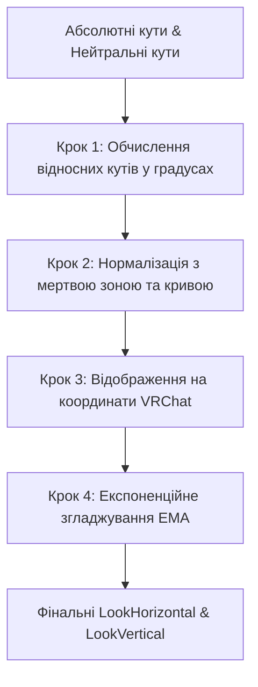
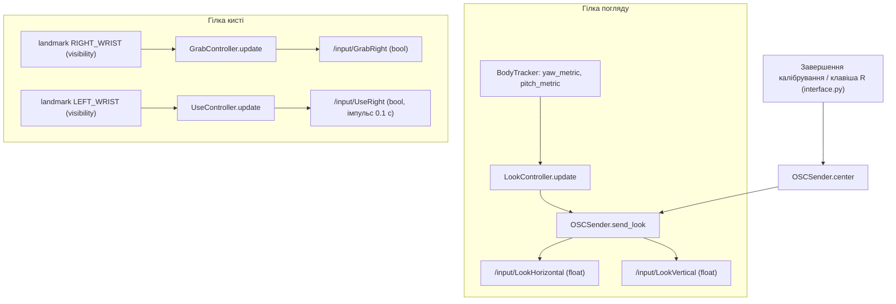
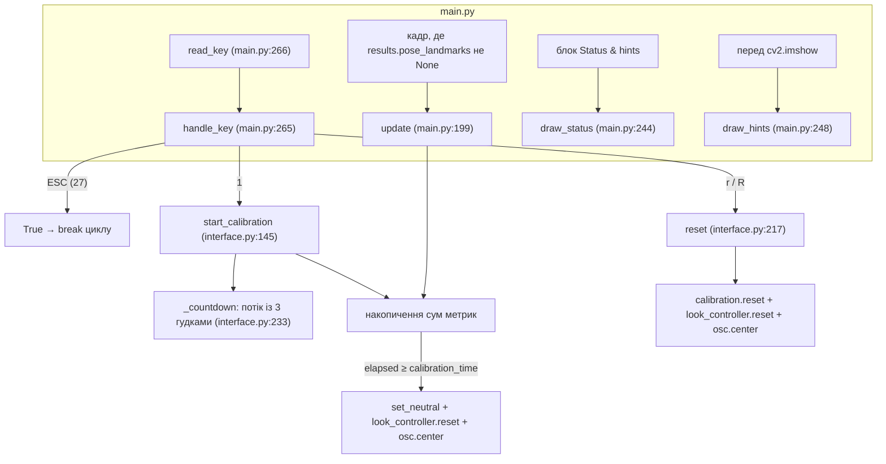

# Документація алгоритмів MediaPipe4VRChat

Цей документ містить покроковий аналіз та математичний опис ключових алгоритмів проекту [MediaPipe4VRChat](file:///C:/Users/User/Yoga/NonVR4VRChat/MediaPipe):
1.  **Відстеження:** Обчислення 3D-орієнтації тулуба ([BodyTracker](file:///C:/Users/User/Yoga/NonVR4VRChat/MediaPipe/body_tracker.py#L65)).
2.  **Логіка керування:** Обробка, фільтрація та відображення кутів у OSC-команди ([LookController](file:///C:/Users/User/Yoga/NonVR4VRChat/MediaPipe/look_controller.py#L38)).
3.  **Вихід у VRChat:** Єдина точка виходу — OSC-повідомлення, та жести кистей, які їх породжують ([OSCSender](file:///C:/Users/User/Yoga/NonVR4VRChat/MediaPipe/osc_sender.py#L63), [GrabController / UseController](file:///C:/Users/User/Yoga/NonVR4VRChat/MediaPipe/grabcontroller.py#L14)).
4.  **Клавіатура та екран:** Гарячі клавіші, сесія калібрування й усе, що малюється поверх відео ([Interface](file:///C:/Users/User/Yoga/NonVR4VRChat/MediaPipe/interface.py#L72)).
5.  **Захоплення кадру:** Який саме пристрій дає відео і що лишається незмінним ([CameraReader](file:///C:/Users/User/Yoga/NonVR4VRChat/MediaPipe/camera_reader.py#L63)).

---

## ЧАСТИНА 1. Відстеження 3D-орієнтації тулуба (BodyTracker)

### 1.1. Вхідні дані
Алгоритм використовує координати суглобів із тривимірного простору MediaPipe, представлені об'єктом [Skeleton](file:///C:/Users/User/Yoga/NonVR4VRChat/MediaPipe/pose_types.py#L36):
*   Плечі: $P_{left\_shoulder}$ та $P_{right\_shoulder}$
*   Стегна: $P_{left\_hip}$ та $P_{right\_hip}$

Кожна точка є об'єктом типу [Vector3](file:///C:/Users/User/Yoga/NonVR4VRChat/MediaPipe/math3d.py#L25) з координатами $(x, y, z)$.

### 1.2. Покроковий опис алгоритму відстеження

```mermaid
graph TD
    subgraph Вхідні дані
        S[Ліве/Праве плече]
        H[Ліве/Праве стегно]
    end

    subgraph Крок 1: Розрахунок центрів
        S -->|Середнє значення| SC[Центр плечей C_shoulder]
        H -->|Середнє значення| HC[Центр стегон C_hip]
    end

    subgraph Крок 2: Векторний аналіз
        SC & HC -->|Різниця векторів| VT[Вектор тулуба V_torso]
        S -->|Різниця векторів| VS[Вектор плечей V_shoulder]
        VT -->|Нормалізація| VT_N[Нормалізований вектор тулуба]
        VS -->|Нормалізація| VS_N[Нормалізований вектор плечей]
    end

    subgraph Крок 3: Кути орієнтації
        VS_N -->|yaw = -atan2(x, z)| Yaw[Абсолютний Yaw]
        VT_N -->|pitch = atan2(y, z)| Pitch[Абсолютний Pitch]
    end
```

#### Крок 1: Обчислення центрів плечей та стегон
Для мінімізації локальних коливань обчислюються середні точки:
1.  **Центр плечей** ($\mathbf{C}_{shoulder}$):
    $$\mathbf{C}_{shoulder} = \frac{\mathbf{P}_{left\_shoulder} + \mathbf{P}_{right\_shoulder}}{2}$$
2.  **Центр стегон** ($\mathbf{C}_{hip}$):
    $$\mathbf{C}_{hip} = \frac{\mathbf{P}_{left\_hip} + \mathbf{P}_{right\_hip}}{2}$$

#### Крок 2: Формування та нормалізація напрямних векторів
1.  **Вектор плечей** ($\mathbf{V}_{shoulder}$):
    Напрямок від лівого плеча до правого:
    $$\mathbf{V}_{shoulder} = \mathbf{P}_{right\_shoulder} - \mathbf{P}_{left\_shoulder}$$
    Вектор нормалізується до одиничної довжини:
    $$\mathbf{\hat{V}}_{shoulder} = \text{normalize}(\mathbf{V}_{shoulder})$$
2.  **Вектор тулуба** ($\mathbf{V}_{torso}$):
    Напрямок від центру стегон до центру плечей (вертикальна вісь хребта):
    $$\mathbf{V}_{torso} = \mathbf{C}_{shoulder} - \mathbf{C}_{hip}$$
    Вектор нормалізується:
    $$\mathbf{\hat{V}}_{torso} = \text{normalize}(\mathbf{V}_{torso})$$

#### Крок 3: Обчислення кутів орієнтації (Yaw та Pitch)
*   **Кут повороту (Yaw / Обертання)**:
    Визначає поворот вліво/вправо навколо вертикальної осі. Обчислюється на основі проекцій вектора плечей на горизонтальну площину $(x, z)$:
    $$\text{yaw\_angle} = -\text{atan2}(\mathbf{\hat{V}}_{shoulder}.x, \mathbf{\hat{V}}_{shoulder}.z)$$
    *Примітка:* Знак мінус компенсує дзеркальність камери для системи координат VRChat.
*   **Кут нахилу (Pitch / Тангаж)**:
    Визначає нахил вперед/назад. Обчислюється через проекції вектора тулуба на площину $(y, z)$:
    $$\text{pitch\_angle} = \text{atan2}(\mathbf{\hat{V}}_{torso}.y, \mathbf{\hat{V}}_{torso}.z)$$

---

## ЧАСТИНА 2. Логіка керування (LookController)

Модуль [LookController](file:///C:/Users/User/Yoga/NonVR4VRChat/MediaPipe/look_controller.py#L38) обробляє отримані кути yaw та pitch, 
фільтрує шум і перетворює їх на нормовані значення погляду для VRChat.

### 2.1. Вхідні дані
*   Поточні абсолютні кути тіла: `yaw_angle` та `pitch_angle` (радіани).
*   Відкалібровані нейтральні кути: `neutral_yaw` та `neutral_pitch` (радіани).

### 2.2. Покроковий опис алгоритму керування

```mermaid
graph TD
    In[Абсолютні кути & Нейтральні кути] --> CalcRel[Крок 1: Обчислення відносних кутів у градусах]
    CalcRel --> Norm[Крок 2: Нормалізація з мертвою зоною та кривою]
    Norm --> MapVR[Крок 3: Відображення на координати VRChat]
    MapVR --> SmoothEMA[Крок 4: Експоненційне згладжування EMA]
    SmoothEMA --> Out[Фінальні LookHorizontal & LookVertical]
```

#### Крок 1: Обчислення відносних кутів у градусах
Для розрахунків відхилення від нейтрального стану обчислюється різниця кутів та переводиться у градуси:
$$\Delta\theta_{yaw} = \text{degrees}(\text{yaw\_angle} - \text{neutral\_yaw})$$
$$\Delta\theta_{pitch} = \text{degrees}(\text{pitch\_angle} - \text{neutral\_pitch})$$

#### Крок 2: Нормалізація та нелінійна обробка `normalize_angle`
Для кожного кута $\theta$ виконуються такі операції:
1.  **Застосування мертвої зони (Dead Zone)**:
    Якщо кут лежить у межах мертвої зони ($|\theta| \le \text{dead\_zone}$), рух ігнорується, і функція повертає $0.0$.
    Якщо кут виходить за межі, мертва зона віднімається для плавного старту:
    $$\theta_{clean} = \theta - \text{dead\_zone} \quad (\text{при } \theta > 0)$$
    $$\theta_{clean} = \theta + \text{dead\_zone} \quad (\text{при } \theta < 0)$$
2.  **Нормалізація**:
    Масштабування кута до діапазону $[-1.0, 1.0]$ на основі максимального робочого діапазону:
    $$\text{normalized} = \frac{\theta_{clean}}{\text{max\_limit} - \text{dead\_zone}}$$
3.  **Обмеження (Clamping)**:
    Значення примусово обмежується в межах $[-1.0, 1.0]$.
4.  **Квадратична характеристика**:
    Для підвищення точності біля центру та чутливості на великих кутах застосовується квадратична крива зі збереженням знаку:
    $$f(x) = \text{sign}(x) \cdot x^2$$

#### Крок 3: Відображення на простір координат VRChat
VRChat приймає значення погляду в діапазоні $[-1.0, 1.0]$, але нейтральне положення зміщене:
*   **Горизонтальний погляд (LookHorizontal)**:
    Центр знаходиться на рівні $0.5$ (при $Y_{norm} = 0$):
    $$H_{target} = 0.5 + 0.5 \cdot Y_{norm} \quad (\text{при } Y_{norm} > 0)$$
    $$H_{target} = -0.5 + 0.5 \cdot Y_{norm} \quad (\text{при } Y_{norm} < 0)$$
*   **Вертикальний погляд (LookVertical)**:
    Центр знаходиться на рівні $0.1$ (при $P_{norm} = 0$):
    $$V_{target} = 0.1 + 0.9 \cdot P_{norm} \quad (\text{при } P_{norm} > 0)$$
    $$V_{target} = -0.1 + 0.9 \cdot P_{norm} \quad (\text{при } P_{norm} < 0)$$

Отримані значення обмежуються функцією `clamp` у межах $[-1.0, 1.0]$.

#### Крок 4: Експоненційне згладжування (EMA)
Для фільтрації тремтіння камери та шумів детекції застосовується експоненційне ковзне середнє з коефіцієнтом згладжування $\alpha = 0.25$:
$$H_{smoothed} = H_{smoothed} + (H_{target} - H_{smoothed}) \cdot 0.25$$
$$V_{smoothed} = V_{smoothed} + (V_{target} - V_{smoothed}) \cdot 0.25$$

---

## ЧАСТИНА 3. Передача OSC (OSCSender / GrabController)

Модуль [OSCSender](file:///C:/Users/User/Yoga/NonVR4VRChat/MediaPipe/osc_sender.py) є єдиною точкою виходу з програми у VRChat. Він не містить ніякої логіки розпізнавання поз — лише серіалізує готові значення в OSC-повідомлення.

### 3.1. Транспорт

* Протокол: OSC поверх UDP, реалізація — `pythonosc.udp_client.SimpleUDPClient` ([osc_sender.py:85](file:///C:/Users/User/Yoga/NonVR4VRChat/MediaPipe/osc_sender.py#L85)).
* Адреса за замовчуванням: `127.0.0.1:9000` ([osc_sender.py:72](file:///C:/Users/User/Yoga/NonVR4VRChat/MediaPipe/osc_sender.py#L72)) — задана значеннями за замовчуванням у конструкторі і не зчитується з `config.json`.
* У VRChat має бути увімкнений модуль OSC (порт 9000).

### 3.2. Покроковий опис передачі

```mermaid
graph TD
    subgraph Гілка погляду
        BT[BodyTracker: yaw_metric, pitch_metric] --> LC[LookController.update]
        LC --> SL[OSCSender.send_look]
        SL --> LH["/input/LookHorizontal (float)"]
        SL --> LV["/input/LookVertical (float)"]
    end

    subgraph Гілка кисті
        RW["landmark RIGHT_WRIST (visibility)"] --> GC[GrabController.update]
        GC --> GR["/input/GrabRight (bool)"]
        LW["landmark LEFT_WRIST (visibility)"] --> UC[UseController.update]
        UC --> UR["/input/UseRight (bool, імпульс 0.1 с)"]
    end

    CAL["Завершення калібрування / клавіша R (interface.py)"] --> CEN[OSCSender.center]
    CEN --> SL
```

Гілка погляду спрацьовує **на кожному кадрі** і лише за умови `calibration.is_ready()` ([main.py:208](file:///C:/Users/User/Yoga/NonVR4VRChat/MediaPipe/main.py#L208)). Гілка кисті працює окремо від калібрування та надсилає повідомлення **лише в момент переходу стану** ([main.py:155](file:///C:/Users/User/Yoga/NonVR4VRChat/MediaPipe/main.py#L155)).

### 3.3. Відповідність «поза → OSC-команда»

#### 3.3.1 `/input/LookHorizontal` — float, $[-1.0; +1.0]$

Вхідна метрика ([body_tracker.py:117](file:///C:/Users/User/Yoga/NonVR4VRChat/MediaPipe/body_tracker.py#L117)) — зміщення носа відносно середини лінії плечей по горизонталі кадру:

$$\text{yaw\_metric} = (x_{ls} + x_{rs}) - 2 \cdot x_{nose}$$

Подальший ланцюжок ([look_controller.py:126](file:///C:/Users/User/Yoga/NonVR4VRChat/MediaPipe/look_controller.py#L126)):

$$\theta_y = \text{yaw\_metric} - \text{neutral\_yaw\_metric}$$
$$s_y = \theta_y \cdot \frac{\text{horizontal\_sensitivity\_pct}}{100} \cdot 10$$
$$Y_{norm} = \text{normalize\_metric}(s_y,\ \text{horizontal\_threshold\_metric},\ \text{max\_horizontal\_metric})$$

де `normalize_metric` ([look_controller.py:100](file:///C:/Users/User/Yoga/NonVR4VRChat/MediaPipe/look_controller.py#L100)) віднімає мертву зону, ділить на $\text{max} - \text{dead\_zone}$, обмежує результат у $[-1; 1]$ та застосовує $sign(x) \cdot x^2$ (точніше біля центру, різкіше на великих відхиленнях); множник $10$ — це `MAX_SENSITIVITY_MULTIPLIER` ([look_controller.py:32](file:///C:/Users/User/Yoga/NonVR4VRChat/MediaPipe/look_controller.py#L32)), тобто 100 % чутливості дають саме таке підсилення.

Відображення у координату VRChat та згладжування:

$$H_{target} = \begin{cases} 0.5 & Y_{norm} = 0 \\ 0.5 + 0.5 \cdot Y_{norm} & Y_{norm} > 0 \\ -0.5 + 0.5 \cdot Y_{norm} & Y_{norm} < 0 \end{cases}$$
$$H \leftarrow H + (H_{target} - H) \cdot (1 - \text{smooth})$$

Емпірично: чим *менший* `smooth`, тим швидше аватар доганяє позу (коефіцієнт EMA дорівнює $1 - \text{smooth}$).

**Поза:** поворот/зміщення голови **вправо** відносно плечей $ \Rightarrow Y_{norm} > 0 \Rightarrow H \in [0.5; 1.0]$; **вліво** $ \Rightarrow H \in [-1.0; -0.5]$; нейтраль $H = 0.5$.

Оскільки метрика будується на різниці «ніс проти плечей», чистий поворот корпусу частково скорочується — керує саме нахилом/поворотом голови *відносно* осі плечей.

#### 3.3.2 `/input/LookVertical` — float, $[-1.0; +1.0]$

Вхідна метрика ([body_tracker.py:124](file:///C:/Users/User/Yoga/NonVR4VRChat/MediaPipe/body_tracker.py#L124)), де $y$ зростає донизу, а $\frac{y_{ls} + y_{rs}}{2}$ — це `shoulder_center()` ([pose_types.py:53](file:///C:/Users/User/Yoga/NonVR4VRChat/MediaPipe/pose_types.py#L53)):

$$\text{pitch\_metric} = \frac{y_{ls} + y_{rs}}{2} - y_{nose}$$

Ланцюжок обробки ідентичний 3.3.1 (вертикальні параметри `vertical_sensitivity_pct`, `vertical_threshold_metric`, `max_vertical_metric`), відображення:

$$V_{target} = \begin{cases} 0.1 & P_{norm} = 0 \\ 0.1 + 0.9 \cdot P_{norm} & P_{norm} > 0 \\ -0.1 + 0.9 \cdot P_{norm} & P_{norm} < 0 \end{cases}$$

**Поза:** опустити голову (підборіддя до грудей) $ \Rightarrow$ `pitch_metric` зменшується $ \Rightarrow V$ прямує до $-1.0$; підняти підборіддя / відхилитися назад $ \Rightarrow V$ прямує до $+1.0$; нейтраль $V = 0.1$.

*Обмеження обох метрик:* вони «z-less» (нормалізовані координати кадру без глибини), тому чутливість залежить від дистанції до камери та зросту користувача: при іншій відстані ті самі кути дадуть іншу метрику, і `config.json` доводиться підлаштовувати повторно.

#### 3.3.3 `/input/GrabRight` — bool

Джерело — `visibility` анатомічно правої кисті ([grabcontroller.py](file:///C:/Users/User/Yoga/NonVR4VRChat/MediaPipe/grabcontroller.py)):

| Умова | Прострочення | Команда |
|---|---|---|
| `visibility ≥ 0.7` (`VISIBILITY_LIMIT`) | ≥ 1 кадр (`VISIBLE_THRESHOLD`) | `/input/GrabRight = True` |
| `visibility < 0.7` | ≥ 3 кадри (`HIDDEN_THRESHOLD`) | `/input/GrabRight = False` |

**Поза:** підняття правої кисті в зону впізнавання — «хоп»; опускання/сховання кисті — «розтиснути». Після кожного переходу обидва лічильники скидаються, тож гістерезису немає.

Два наслідки такої реалізації:
1. Подія не прив'язана до калібрування — працює одразу після запуску.
2. Якщо MediaPipe не повертає жодної пози (`results.pose_landmarks is None`), `GrabController.update()` не викликається, отже `GrabRight = False` не надійде, і хоп залишиться активним.

**Семантика `GrabRight` на боці VRChat — утримування, а не клік.** Підтверджено реальним експериментом користувача (2026-09-27): предмет опиняється в руці, коли кисть піднята (`GrabRight = True`), **лишається в ній рівно стільки, скільки тримається `True`**, і падає, щойно приходить `GrabRight = False`. Це означає, що:

* варіант «імпульс `1 → 0` одразу» (який можна вивести з загального правила для кнопок у документації OSC — «Buttons expect an int of 1 for "pressed" and 0 for "released"», і який радить обхідний шлях з [osc issue #107](https://github.com/vrchat-community/osc/issues/107) для PCVR) у цій інтеграції **непридатний**: фронт `1 → 0` і є та дія розтиснення, яка роняє предмет, тож рука лишиться порожньою;
* `/input/DropRight` для скидання **не потрібна** — розтиснення вже реалізоване як `GrabRight = False`. Офіційно `DropRight` означає «Drop the item **held** in your right hand» (тобто скинути те, що вже в руці, не залежно від того, хто і чим його хапав), на відміну від `GrabRight` — «Grab the item **highlighted** by your right hand»;
* предмет неможливо нести, сховавши кисть з кадру, а втрата пози взагалі залишає хоп активним (наслідок 2 вище) — єдиний спосіб скинути тоді переставити кисть назад у кадр.

Трьома кадрами `HIDDEN_THRESHOLD` визначається і затримка падіння: `False` надходить не в момент опускання руки, а через три кадри після того, як кисть перестала бути видно (`≈ 100 мс` за 30 FPS).

Про саму інтеграцію: обидві адреси в документації VRChat позначені як «VR Only», але за [osc issue #111](https://github.com/vrchat-community/osc/issues/111) `GrabRight`/`UseRight` працюють і в десктопному режимі, якщо вікно VRChat сфокусоване — саме так і використовується цей проєкт.

#### 3.3.4 `/input/UseRight` — дія предмета (bool, імпульс)

Джерело — `visibility` анатомічно **лівої** кисті: [main.py:158](file:///C:/Users/User/Yoga/NonVR4VRChat/MediaPipe/main.py#L158) дістає landmark `LEFT_WRIST` і передає його в `UseController.update()` ([grabcontroller.py:85](file:///C:/Users/User/Yoga/NonVR4VRChat/MediaPipe/grabcontroller.py#L85)), а той надсилає [send_use_right()](file:///C:/Users/User/Yoga/NonVR4VRChat/MediaPipe/osc_sender.py#L225).

На відміну від хапка це **не стан, а подія**:

* `left_wrist.visibility ≥ VISIBILITY_LIMIT` (`0.7`) хоча б один кадр (`VISIBLE_THRESHOLD = 1`) → `UseRight = True` ([grabcontroller.py:125](file:///C:/Users/User/Yoga/NonVR4VRChat/MediaPipe/grabcontroller.py#L125)), і через `USE_PRESS_SECONDS = 0.1` с → `UseRight = False` ([grabcontroller.py:132](file:///C:/Users/User/Yoga/NonVR4VRChat/MediaPipe/grabcontroller.py#L132));
* після пострілу контролер «роззброєний» (`armed = False`) і озброюється знову лише тоді, коли ліва кисть не потрапляє у зону впізнавання `HIDDEN_THRESHOLD = 3` кадри поспіль ([grabcontroller.py:109](file:///C:/Users/User/Yoga/NonVR4VRChat/MediaPipe/grabcontroller.py#L109));
* підсумок: **один жест — одна дія**. Стояння з піднятою лівою рукою не перетворюється на безперервний спам `Use`, як було б, скопіюй тут утримувальну логіку `GrabController`.

**Поза:** підняти ліву кисть у кадр — «використати» предмет, на який дивиться аватар; опустити — повернути жест у готовність (`0` надсилається сам через 0.1 с, чекати на нього не треба).

Імпульс виконується в окремому потоці (`_press` → `_press_cycle`, [grabcontroller.py:113](file:///C:/Users/User/Yoga/NonVR4VRChat/MediaPipe/grabcontroller.py#L113)), щоб `time.sleep(0.1)` не зупиняв цикл обробки кадрів — інакше кожен жест з'їдав би ~3 кадри. Потік `daemon`, посилання зберігається в `self.press_thread` (щоб тести могли дочекатися завершення). Тривалість натискання — аргумент конструктора `press_seconds` (типово `0.1`), подібно до `calibration_time` в `Interface`.

Спад той самий, що й у хапка: без виявленої пози `UseController.update()` не викликається. Але на відміну від `GrabRight` тут нічого не «зависає» — `False` надсилається потоком за таймером, а не за переходом стану, тож втрата пози не залишає натиснуту кнопку.

Вивід: `OSC: /input/UseRight = True/False` (3.7) і `Action: Use` ([grabcontroller.py:128](file:///C:/Users/User/Yoga/NonVR4VRChat/MediaPipe/grabcontroller.py#L128)) — обидва під `debug`.

### 3.4. Службове повідомлення `center()`

[OSCSender.center()](file:///C:/Users/User/Yoga/NonVR4VRChat/MediaPipe/osc_sender.py#L240) надсилає пару `LookHorizontal = 0.0`, `LookVertical = 0.0`. Точки виклику:

* завершення калібрування ([interface.py:208](file:///C:/Users/User/Yoga/NonVR4VRChat/MediaPipe/interface.py#L208)) — значення одразу перезаписується наступним кадром, який дає нейтраль $0.5/0.1$;
* скидання клавішею `R` ([interface.py:229](file:///C:/Users/User/Yoga/NonVR4VRChat/MediaPipe/interface.py#L229)) — калібрування стає неготовим, тому `send_look` більше не викликається й погляд фактично «замирає» на $0.0$.

### 3.5. Невикористані методи

Визначені в `OSCSender`, але жодного разу не викликані з коду проєкту:

* `send_drop_right()` → `/input/DropRight` ([osc_sender.py:212](file:///C:/Users/User/Yoga/NonVR4VRChat/MediaPipe/osc_sender.py#L212)) — розтиснення реалізоване як `GrabRight = False`, тож ця адреса у трафіку не з'являється; з тієї ж причини ніколи не друкується й її відладочне повідомлення (3.7);
* `send_horizontal()` ([osc_sender.py:157](file:///C:/Users/User/Yoga/NonVR4VRChat/MediaPipe/osc_sender.py#L157)) та `send_vertical()` ([osc_sender.py:179](file:///C:/Users/User/Yoga/NonVR4VRChat/MediaPipe/osc_sender.py#L179)) — поодинокі осі, натомість використовується парний `send_look()`.

### 3.6. Дзеркалювання та знаки

Формулювання «голова вправо $ \Rightarrow $ додатнє відхилення» у 3.3.1–3.3.2 коректні лише для **невіддзеркаленого** захоплення. Причина в тому, де саме відбувається перевертання кадру:

* `CameraReader` ([camera_reader.py:120](file:///C:/Users/User/Yoga/NonVR4VRChat/MediaPipe/camera_reader.py#L120)) кадр не перевертає — у `read()` повертається сирій буфер `cv2.VideoCapture`;
* `MediaPipe` отримують саме цей сирій кадр: `rgb = cv2.cvtColor(frame, cv2.COLOR_BGR2RGB)` до будь-якого `flip`, тому landmark-координати живуть у системі координат камери;
* `cv2.flip(frame, 1)` у [main.py:128](file:///C:/Users/User/Yoga/NonVR4VRChat/MediaPipe/main.py#L128) стосується лише **показу** вікна (і, відповідно, координат точок, які малюють у тому ж кадрі через `(1 - landmark.x) * w`), на метрики не впливає.

Наслідок: якщо драйвер або камера дзеркалюють зображення апаратно, фізичний напрямок усередині тієї самої OSC-команди перевернеться — це конфігурація камери, а не властивість коду. Тож при першому запуску варто перевірити обидва напрямки на собі, а не вважати знаки у 3.3.1–3.3.2 абсолютними.

### 3.7. Відладочний вивід

Ключ `debug` — єдиний параметр верхнього рівня в `config.json`, який читає не `LookController`, а [load_debug_flag()](file:///C:/Users/User/Yoga/NonVR4VRChat/MediaPipe/osc_sender.py#L37) ([osc_sender.py:37](file:///C:/Users/User/Yoga/NonVR4VRChat/MediaPipe/osc_sender.py#L37)). Значення знімається один раз — у конструкторі `OSCSender` ([osc_sender.py:81](file:///C:/Users/User/Yoga/NonVR4VRChat/MediaPipe/osc_sender.py#L81)), тому зміна `config.json` під час роботи ні на що не вплине: потрібен перезапуск. Немає файлу, немає ключа, не валідний JSON — вивід вимкнено (`False`) і в консоль виводиться один рядок помилки; програма при цьому працює далі.

Конструктор приймає і явний аргумент `debug=` (типово `None` — «читати з файла»), тож тести будують `OSCSender(debug=True/False)` і не чіпають `config.json`.

Друк у всьому модулі один — `OSCSender._debug_message()` ([osc_sender.py:92](file:///C:/Users/User/Yoga/NonVR4VRChat/MediaPipe/osc_sender.py#L92)), і викликають його всі п'ять методів надсилання одразу після `client.send_message`: `send_look()` для обох осей ([osc_sender.py:145](file:///C:/Users/User/Yoga/NonVR4VRChat/MediaPipe/osc_sender.py#L145), [150](file:///C:/Users/User/Yoga/NonVR4VRChat/MediaPipe/osc_sender.py#L150)), `send_horizontal()` ([172](file:///C:/Users/User/Yoga/NonVR4VRChat/MediaPipe/osc_sender.py#L172)), `send_vertical()` ([194](file:///C:/Users/User/Yoga/NonVR4VRChat/MediaPipe/osc_sender.py#L194)), `send_grab_right()` ([210](file:///C:/Users/User/Yoga/NonVR4VRChat/MediaPipe/osc_sender.py#L210)) та `send_drop_right()` ([221](file:///C:/Users/User/Yoga/NonVR4VRChat/MediaPipe/osc_sender.py#L221)). Формат — `OSC: /input/LookHorizontal = 0.523` (три знаки після коми), і це **обмежене** значення після clamp у $[-1; 1]$, тобто вивід показує саме те, що летить у VRChat, а не те, що порахував `LookController` до обмеження.

Частота виводу залежить від типу команди:

* логічні (`GrabRight`, `DropRight`) — це події, тому друкуються щоразу;
* речові осі — лише коли $\lvert \text{нове} - \text{останнє надруковане} \rvert \ge$ `DEBUG_VALUE_STEP = 0.01` ([osc_sender.py:30](file:///C:/Users/User/Yoga/NonVR4VRChat/MediaPipe/osc_sender.py#L30)).

Поріг рахується від останнього **надрукованого** значення, а не від попереднього кадру, тому повільний дрейф усе одно вилізе в консоль, а стояння на місці не дасть жодного рядка. Без цього правила вивід затоплював би консоль ~30 рядками за секунду на кожну вісь, бо `send_look()` викликається на кожному кадрі (3.2).

`GrabController` власного прапорця не має й позичає його у відправника: `Action: Grab` ([grabcontroller.py:44](file:///C:/Users/User/Yoga/NonVR4VRChat/MediaPipe/grabcontroller.py#L44)) і `Action: Drop` ([grabcontroller.py:53](file:///C:/Users/User/Yoga/NonVR4VRChat/MediaPipe/grabcontroller.py#L53)) друкуються лише при `debug: true`. Тобто на одну подію хоп у консолі два рядки: `OSC: /input/GrabRight = True` (команда в мережі) і `Action: Grab` (перехід стану в `GrabController`).

Під `debug` **не** підпадають повідомлення, які описують стан роботи, а не відладку: банер з переліком клавіш, `Режим калібрування...` із зворотним відліком, `Calibration completed.`, `Reset.` та ехо налаштувань `config.json` із конструктора `LookController` — вони друкуються завжди.

### 3.8. Ручна перевірка кнопок — `osc_use_probe.py`

[osc_use_probe.py](file:///C:/Users/User/Yoga/NonVR4VRChat/MediaPipe/osc_use_probe.py) — окрема програма, яка шле кнопки `/input/` у VRChat **без камери й MediaPipe**, щоб виміряти, чи команда взагалі доходить і з якою семантикою. Транспорт той самий, що в роботі: створюється справжній `OSCSender` (типовий порт 9000 — [osc_sender.py:73](file:///C:/Users/User/Yoga/NonVR4VRChat/MediaPipe/osc_sender.py#L73)), але повідомлення йдуть напряму через `sender.client.send_message`, бо адреса вибирається щоразу з аргументів — `send_*()`-методи під це не гнуть.

Назва файла **навмисно не** `test_*`: pytest зібрав би функції звідти й надіслав би реальні команди у VRChat під час прогону перевірок.

Ключі запуску (`main()` — [osc_use_probe.py:204](file:///C:/Users/User/Yoga/NonVR4VRChat/MediaPipe/osc_use_probe.py#L204)):

* `--address` (типово `UseRight`) — одна з `BUTTONS` ([osc_use_probe.py:43](file:///C:/Users/User/Yoga/NonVR4VRChat/MediaPipe/osc_use_probe.py#L43)): `UseRight`, `UseLeft`, `GrabRight`, `GrabLeft`, `DropRight`, `DropLeft`; можна й повну адресу (`/avatar/Crouch` лишається як є), тоді програма попереджає, що кнопки такої не знає;
* `--hold` (типово `0.1` с) — скільки тримати `1` перед `0` у межах одного натискання ([press_cycle](file:///C:/Users/User/Yoga/NonVR4VRChat/MediaPipe/osc_use_probe.py#L95)). Це і є вимірювач семантики: `0.1` — «клік», `3` — «утримування»;
* `--interval` (3 с) і `--count` (5; `0` — до `Ctrl+C`) — повторюваність, щоб не запускати програму щоразу;
* `--start-delay` (8 с) — зворотний відлік на старті, щоб встигнути перемкнути фокус у вікно VRChat;
* `--as-int` — надсилати `1`/`0` цілими замість `True`/`False`: документація OSC формулює кнопки як «int of 1», а `GrabController` надсилає саме bool (і з ним хапок працює), тож для `Use` тип значення — окрема гіпотеза;
* `--dry-run` — показати, що б надіслалось, без мережі.

Дві умови, без яких тест нічого не доводить, і програма друкує відповідну підказку залежно від адреси: фокус вікна VRChat у момент надсилання (без нього кнопки рук у десктопі не працюють) і правильна ціль — `Use` та `Grab` діють на предмет, **підсвічений** цією рукою, а `Drop` — на той, що **вже в руці**.

Пастка середовища: у Git Bash MSYS переписує аргументи, що починаються з `/`, тому `--address /input/Jump` доходить до програми як `/input/C:/Program Files/Git/input/Jump`. [resolve_address()](file:///C:/Users/User/Yoga/NonVR4VRChat/MediaPipe/osc_use_probe.py#L57) ріже рядок по останньому входженні `/input/`, тому обидва записи й гола назва дають правильну адресу; надійніше все одно передавати голу назву.

Стан вимірювань:

* `GrabRight` — **утримування**, підтверджено вручну (деталі та наслідки — 3.3.3).
* `UseRight` — **працює в десктопі за наведення головою**, підтверджено вручну 2026-09-27. Умови досвіду: предмет **лежав на землі** (аватар його не тримав), наведення на нього робив **корпус/голова** — тобто ціль опинилась у центрі екрана через `LookHorizontal`/`LookVertical`, які ця програма й керує замість миші. У момент натискання предмет **відлетів від аватара**.

З цього випливають два висновки. По-перше, `Use` — це «виконати дію предмета», а не другий спосіб хапання: дія береється з налаштувань самого pickup-об'єкта у світі (тут нею виявився кидок), і в іншому світі/на іншому предметі буде іншою. По-друге й найважливіше для проєкту: **у десктопі ціль взаємодії визначається напрямком камери, а камера тут керується поглядом** — отже `UseRight` придатний для жестикуляції без миші, бо «кудось подивився» фактично означає «на що навів».

За результатами цього вимірювання `UseRight` **вбудовано в програму й перевірено в грі** (2026-09-27): жест — підняття лівої кисті, взірець натискання — імпульс 0.1 с (3.3.4). Пробник лишається знаряддям для наступних кнопок: ним же можна перевірити `UseLeft`, `DropRight` чи поведінку `--as-int`.

Ще не виміряно: поведінка `UseRight` на предмет, який уже **в руці**; чи різниться результат між `True/False` та `1/0` (`--as-int`); і чи коротке натискання можна повторювати без скидання в 0.

Косвенні підказки на користь короткого натискання: загальне правило кнопок у документації («без скидання в 0 наступний 1 не рахується») і обхідний шлях з [osc issue #107](https://github.com/vrchat-community/osc/issues/107) для PCVR («відправити `0` менш ніж за пів секунди»). Результат вимірювання записувати сюди (зразок — запис про `GrabRight` у 3.3.3), а не лишати в коментарях коду.

---

## ЧАСТИНА 4. Клавіатурний інтерфейс (Interface)

Модуль [interface.py](file:///C:/Users/User/Yoga/NonVR4VRChat/MediaPipe/interface.py) зосереджує все, що пов'язано з гарячими клавішами вікна OpenCV: читання клавіші, дію неї, сесію калібрування, яку запускає клавіша `1`, і службовий текст на кадрі. Раніше цей код лежав у локальних змінних основного циклу `main.py`; перенесення не змінювало логіки (див. 4.5).

### 4.1. Точки дотику з основним циклом

```mermaid
graph TD
    subgraph main.py
        WK["read_key (main.py:266)"] --> HK["handle_key (main.py:265)"]
        POSE["кадр, де results.pose_landmarks не None"] --> UPD["update (main.py:199)"]
        DISP["блок Status & hints"] --> ST["draw_status (main.py:244)"]
        SHOW["перед cv2.imshow"] --> HN["draw_hints (main.py:248)"]
    end

    HK -->|"ESC (27)"| QUIT["True → break циклу"]
    HK -->|"1"| SC["start_calibration (interface.py:145)"]
    HK -->|"r / R"| RS["reset (interface.py:217)"]

    SC --> THR["_countdown: потік із 3 гудками (interface.py:233)"]
    SC --> ACC["накопичення сум метрик"]
    UPD --> ACC
    ACC -->|"elapsed ≥ calibration_time"| FIN["set_neutral + look_controller.reset + osc.center"]
    RS --> RST["calibration.reset + look_controller.reset + osc.center"]
```

Сам `main.py` кодів клавіш не знає: він отримує лише булеве «чи виходимо» (`main.py:265`) і щойно виклик `interface.update(yaw_metric, pitch_metric)` на кожному кадрі з позою (`main.py:199`). Залежності в ін'єкції — `Calibration`, `LookController`, `OSCSender` — створюються в `main.py` і передаються у конструктор `Interface` (`main.py:91`).

### 4.2. Коди клавіш і диспетчеризація

* **Зчитування.** `Interface.read_key()` ([interface.py:111](file:///C:/Users/User/Yoga/NonVR4VRChat/MediaPipe/interface.py#L111)) — обгортка над `cv2.waitKey(1)`. Наслідки HighGUI-моделі: **не більше однієї клавіші за кадр**; клавіші, натиснуті між кадрами, не губляться, а лишаються в черзі й читаються наступного кадру (при ~30 FPS це затримка до 33 мс); якщо фокус вікна втрачено, події не надходять узагалі.
* **Розподіл.** `Interface.handle_key()` ([interface.py:120](file:///C:/Users/User/Yoga/NonVR4VRChat/MediaPipe/interface.py#L120)) повертає `True` лише для `KEY_ESCAPE = 27` ([interface.py:35](file:///C:/Users/User/Yoga/NonVR4VRChat/MediaPipe/interface.py#L35)). `1` — `KEY_CALIBRATE = ord("1")` ([interface.py:37](file:///C:/Users/User/Yoga/NonVR4VRChat/MediaPipe/interface.py#L37)); `R` — `KEY_RESET = (ord("r"), ord("R"))` ([interface.py:39](file:///C:/Users/User/Yoga/NonVR4VRChat/MediaPipe/interface.py#L39)), тож регістр не має значення. Будь-яка інша клавіша, як і `waitKey` без натискання (повертає `-1`), не має жодного ефекту.
* **Єдине джерело тексту підказок.** Список `KEY_HINTS` ([interface.py:43](file:///C:/Users/User/Yoga/NonVR4VRChat/MediaPipe/interface.py#L43)) живить і консольний банер `print_banner()` ([interface.py:332](file:///C:/Users/User/Yoga/NonVR4VRChat/MediaPipe/interface.py#L332)), і рядок на кадрі (4.4), тому перелік клавіш у консолі та у вікні не розійдуться.

### 4.3. Сесія калібрування

Стан сесії (`calibrating`, `sum_yaw_metric`, `sum_pitch_metric`, `sample_count`, `calibration_start`) живе в екземплярі `Interface`, а не в модульних змінних циклу.

1. `start_calibration()` ([interface.py:145](file:///C:/Users/User/Yoga/NonVR4VRChat/MediaPipe/interface.py#L145)) виставляє `calibrating = True` ([interface.py:154](file:///C:/Users/User/Yoga/NonVR4VRChat/MediaPipe/interface.py#L154)), фіксує `calibration_start = time.time()`, обнуляє суми й лічильник, і запускає потік `_countdown()` ([interface.py:233](file:///C:/Users/User/Yoga/NonVR4VRChat/MediaPipe/interface.py#L233)): три гудки `winsound` частотою 1000 Гц тривалістю 200/200/700 мс із друком `3.......`, `2.......`, `1.......`. Потік `daemon` ([interface.py:168](file:///C:/Users/User/Yoga/NonVR4VRChat/MediaPipe/interface.py#L168)), тож вихід під час відліку його не чекає; посилання зберігається в `self.countdown_thread` ([interface.py:170](file:///C:/Users/User/Yoga/NonVR4VRChat/MediaPipe/interface.py#L170)).
2. `Interface.update()` ([interface.py:176](file:///C:/Users/User/Yoga/NonVR4VRChat/MediaPipe/interface.py#L176)) на кожному кадрі з виявленою позою додає метрики та збільшує `sample_count`. Нейтраль — арифметичне середнє за $N$ зразків:

$$\text{neutral\_yaw\_metric} = \frac{1}{N}\sum_{i=1}^{N}\text{yaw\_metric}_i \qquad \text{neutral\_pitch\_metric} = \frac{1}{N}\sum_{i=1}^{N}\text{pitch\_metric}_i$$

3. Як тільки $\Delta t = t_{кадр} - \text{calibration\_start} \ge$ `calibration_time` (типово `CALIBRATION_TIME = 4.0` с, [interface.py:33](file:///C:/Users/User/Yoga/NonVR4VRChat/MediaPipe/interface.py#L33), перевизначається аргументом конструктора), викликаються `calibration.set_neutral()` ([calibration.py:36](file:///C:/Users/User/Yoga/NonVR4VRChat/MediaPipe/calibration.py#L36)), `look_controller.reset()` ([look_controller.py:91](file:///C:/Users/User/Yoga/NonVR4VRChat/MediaPipe/look_controller.py#L91)) і `osc.center()` ([interface.py:208](file:///C:/Users/User/Yoga/NonVR4VRChat/MediaPipe/interface.py#L208)); `calibrating` гасне, у консоль виводиться `Calibration completed.` і `calibration.print()`.

Оскільки $N \ge 1$ у момент завершення (зразок додається до перевірки часу), ділення на нуль у цьому коді неможливе.

### 4.4. Рендер підказки та індикатора стану

`draw_hints(frame)` ([interface.py:291](file:///C:/Users/User/Yoga/NonVR4VRChat/MediaPipe/interface.py#L291)) викликається **поза** блоком перевірки пози ([main.py:248](file:///C:/Users/User/Yoga/NonVR4VRChat/MediaPipe/main.py#L248)), тому рядок видно і коли позу не знайдено. Малювання йде просто в буфер кадру — окремого UI-шару в OpenCV немає:

* смуга: прямокутник `cv2.FILLED` кольору `BAR_COLOR = (0, 0, 0)` від $y_{top} = \max(h - \text{BAR\_HEIGHT}, 0)$ до низу, де `BAR_HEIGHT = 28` px ([interface.py:59](file:///C:/Users/User/Yoga/NonVR4VRChat/MediaPipe/interface.py#L59));
* текст: `"[1] Calibration   [R] Reset   [ESC] Quit"`, колір `HINT_COLOR = (0, 255, 0)`, `FONT_HERSHEY_SIMPLEX`, масштаб `0.55`, товщина `1`;
* позиція — центрування через `cv2.getTextSize` $(w_{text}, h_{text})$:

$$x = \max\!\left(\frac{w - w_{text}}{2},\, 0\right) \qquad y = h - \max\!\left(\frac{\text{BAR\_HEIGHT} - h_{text}}{2},\, 0\right)$$

Обидва `max(..., 0)` — захист від кадру меншого за смугу: при $h < 28$ смуга зливається з усім кадром, а текст лишається в його межах.

* Напис свідомо **латиницею**: Hershey-шрифти `cv2.putText` не містять кириличних літер, тому український текст у вікні перетворився б на порожні місця або квадратики (консоль — UTF-8, там українська працює).

Стан калібрування малює `draw_status(frame)` ([interface.py:255](file:///C:/Users/User/Yoga/NonVR4VRChat/MediaPipe/interface.py#L255)) одним рядком у точці `(10, 80)`, залежно від стану:

* сесія активна → `CALIBRATION...` червоним `(0, 0, 255)` (`STATUS_COLOR`);
* сесії немає і калібрування ще не робилось (`calibration.is_ready()` хибне) → `NO CALIBRATION - PRESS 1` жовтим `(0, 255, 255)` (`WARNING_COLOR`, [interface.py:65](file:///C:/Users/User/Yoga/NonVR4VRChat/MediaPipe/interface.py#L65));
* відкалібровано і сесії немає → жодного рядка.

Викликається **поза** гілкою з виявленою позою ([main.py:244](file:///C:/Users/User/Yoga/NonVR4VRChat/MediaPipe/main.py#L244), спільний блок «Status & hints» разом з `draw_hints`), тому попередження не зникає, коли камера втратить користувача. Рядок `Pose not detected` лишився в `main.py` у точці `(10, 40)` — на рядок вище за статус, тож обидва можуть бути видимі одночасно і не перекриваються.

**Технічний вивід з екрана прибрано** (2026-09-27): `FPS`, `Yaw Metric`, `Pitch Metric`, `LookH`, `LookV` і підписи `x=`/`y=`/`z=` біля кожної точки. Залишились лише точки (`cv2.circle`, [main.py:178](file:///C:/Users/User/Yoga/NonVR4VRChat/MediaPipe/main.py#L178)), попередження, індикатор калібрування та смуга підказки. Числа не зникли зовсім — той самий `LookHorizontal`/`LookVertical` видно в консолі через відладочний вивід (3.7). Значення `fps` рахується й далі ([main.py:145](file:///C:/Users/User/Yoga/NonVR4VRChat/MediaPipe/main.py#L145)), бо передається в `create_pose_frame`; а от гілка `else` з обнуленням `look_horizontal`/`look_vertical` прибрано як мертву — єдиним читачем тих змінних був накладений текст.

### 4.5. Збережені нюанси поведінки

Усі три дісталися у спадок від версії в `main.py`; перенесення навмисне не змінювало логіку:

* **Повторне `1` під час активної сесії ігнорується** — `start_calibration()` виходить одразу, тож накопичені зразки не обнуляються, а зворотний відлік не запускається вдруге.
* **`R` під час активної сесії її не скасовує** — `reset()` ([interface.py:217](file:///C:/Users/User/Yoga/NonVR4VRChat/MediaPipe/interface.py#L217)) скидає калібрування, контролер погляду й надсилає `center()`, але `calibrating` лишається `True`; за кілька секунд сесія доживає до кінця і знову записує нейтраль.
* **Втрата пози підвішує сесію назавжди.** Зразки додаються лише в кадрі, де `results.pose_landmarks` не `None`, тому без пози сесія не завершиться ніколи і `1` її не перезапустить. Індикатор `CALIBRATION...` тепер лишається видимим (його виклик винесено поза гілку з позою, 4.4), тож підвішену сесію принаймні видно; прибрати її можна лише `R` + `1`.

### 4.6. Чим це перевіряється

`test_interface.py` ([test_interface.py](file:///C:/Users/User/Yoga/NonVR4VRChat/MediaPipe/test_interface.py)) — 11 перевірок, які запускаються без камери, вікна та VRChat (`.venv/Scripts/python.exe -m pytest`, або те саме скриптом `python test_interface.py`). `Calibration`, `LookController` і `OSCSender` підмінені заглушками, які лише рахують виклики й пам'ятають передану нейтраль; `time` і `winsound` підмінюються на рівні модуля `interface`, тому сесія калібрування прокручується миттєво і без гудків, а таймінг задається вручну.

Покриття: `ESC` → запит на вихід; `r`/`R` → три виклики скидання; невідома клавіша та `-1` → без ефектів; $N$-зразкове усереднення та завершення за часом; обидва перші нюанси з 4.5; `update()` поза сесією; смуга підказки (верх кадру не чіпаний, смуга мальована, зелені пікселі тексту є) і поведінка на кадрі 20×320; статус калібрування у всіх трьох станах (попередження жовтим → `CALIBRATION...` червоним → чисто); єдність `KEY_HINTS` у банері.

Третій нюанс (підвішена сесія після втрати пози) тестом **не покритий** — він вимагає імітації всього циклу з MediaPipe, а не тільки `Interface`.

Зваж на зв'язність: тести чіпаються внутрішностей (`interface.time`, `interface.winsound`, `iface.sum_yaw_metric`, `iface.countdown_thread`), тож перейменування цих сутностей у `interface.py` вимагатиме правки тестів.

---

## ЧАСТИНА 5. Захоплення кадру (CameraReader)

### 5.1. Вибір камери з config.json

Ключ `camera_index` (верхній рівень `config.json`, поряд з `debug`) читає [load_camera_index()](file:///C:/Users/User/Yoga/NonVR4VRChat/MediaPipe/camera_reader.py#L34). Пріоритет той самий, що в `OSCSender.debug` (3.7): `CameraReader.__init__(camera_index=None)` ([camera_reader.py:65](file:///C:/Users/User/Yoga/NonVR4VRChat/MediaPipe/camera_reader.py#L65)) бере значення з файла лише коли викликач мовчить, а явний аргумент перемагає. Саме тому [main.py:39](file:///C:/Users/User/Yoga/NonVR4VRChat/MediaPipe/main.py#L39) створює `CameraReader()` **без** аргументу — до цього там стояв жорсткий `0`, який зробив би ключ мертвим.

* Ключ є і це ціле (або рядок, що приводиться до цілого: `"2"` → `2`) → значення зберігається у `self.camera_index` ([camera_reader.py:72](file:///C:/Users/User/Yoga/NonVR4VRChat/MediaPipe/camera_reader.py#L72)) і передається в `cv2.VideoCapture(camera_index, cv2.CAP_DSHOW)`;
* файла немає / JSON битий / ключа немає / значення не приводиться до цілого (`null`, `"abc"`, корінь-масив замість об'єкта) → `DEFAULT_CAMERA_INDEX = 0` ([camera_reader.py:27](file:///C:/Users/User/Yoga/NonVR4VRChat/MediaPipe/camera_reader.py#L27)) і рядок `Error loading config.json: ... Camera index 0.` у консоль. Програма не падає.

Фолбек саме на `0` зберігає поведінку до появи ключа, коли індекс був захардкоджений. Мовчазного фолбеку тут навмисне немає: не та камера без жодного рядка виводу виглядає як «програма не працює», а не як «взяла не той пристрій».

Читається один раз — у конструкторі, ще до `camera.start()`, тому зміна `config.json` під час роботи непомітна й потребує перезапуску.

Ще залишається захардкодженим у [CameraReader](file:///C:/Users/User/Yoga/NonVR4VRChat/MediaPipe/camera_reader.py#L63) і в конфіг **не** виносилось: бекенд `cv2.CAP_DSHOW` ([camera_reader.py:76](file:///C:/Users/User/Yoga/NonVR4VRChat/MediaPipe/camera_reader.py#L76)) та бажана роздільна здатність 640×480 ([camera_reader.py:79](file:///C:/Users/User/Yoga/NonVR4VRChat/MediaPipe/camera_reader.py#L79), [80](file:///C:/Users/User/Yoga/NonVR4VRChat/MediaPipe/camera_reader.py#L80)). Роздільна здатність саме «бажана»: `VideoCapture.set()` не повертає помилку, коли камера режиму не підтримує, тож фактичний кадр може бути іншого розміру.

### 5.2. Очікування першого кадру

Цикл обробки не може початися без кадру, тому [main.py:45](file:///C:/Users/User/Yoga/NonVR4VRChat/MediaPipe/main.py#L45) після `camera.start()` викликає [wait_first_frame()](file:///C:/Users/User/Yoga/NonVR4VRChat/MediaPipe/camera_reader.py#L132) — замість прежнього голого `while True: camera.read()`, який висів мовчки з неіснуючим індексом камери.

Логіка: читати до успіху, між спробами спати `poll_interval` (0.01 с), а якщо від останнього попередження минуло `warn_after` (5 с) — друкувати [_warn_no_frame()](file:///C:/Users/User/Yoga/NonVR4VRChat/MediaPipe/camera_reader.py#L165). Попередження **періодичне**, не одноразове: зависле на хвилину вікно помічають саме по повторюваному рядку, а якщо камеру під'єднають пізніше, підказка ще актуальна. Дедлайна цикл не має й програму не завершує — порівняно з попередньою версією змінився лише вивід, не поведінка.

Два різні тексти, бо це дві різні несправності (обидві перевірені на реальному залізі):

* `isOpened()` істина, а кадрів немає → `Камера 0 кадрів не дає (чекаємо 5 с). Перевір camera_index у config.json або під'єднай пристрій.` — пристрій живий, але не стрімить (зайнятий іншою програмою, завис драйвер);
* `isOpened()` хибна → `Камера 99 не відкрилась (чекаємо 5 с). ...` — індексу просто не існує.

OpenCV і сам друкує `[WARN] cap.cpp: cv::VideoCapture::open VIDEOIO(DSHOW): backend is generally available but can't be used to capture by index`, але власний рядок конкретніший: в ньому є номер камери й назва ключа, який треба виправити.

### 5.3. Чим перевіряється

`test_camera_reader.py` — 9 перевірок **без відкриття камери**: читання `0`/`1`/`2` і рядка `"3"`; фолбек при відсутньому файлі, порожньому об'єкті та `null`; фолбек при битому JSON, не-числі й корені-масиві; наявність рядка помилки у виводі; збіг `load_camera_index()` з поточним `config.json`; типовий аргумент конструктора — `None` (інакше конфіг ніколи б не читався); і три перевірки `wait_first_frame()` — повертає перший успішний кадр і мовчить, коли він прийшов одразу; друкує номер камери та назву ключа, коли кадрів немає; розрізняє «не відкрилась» і «кадрів не дає».

Перші чотири підміняють `camera_reader.__file__` на тимчасовий каталог зі своїм `config.json`, тому справжній файл лишається недоторканим. Очікування першого кадру тестує `FakeReader` — підклас, який **не** викликає `CameraReader.__init__`, а підставляє заглушку замість `cv2.VideoCapture` і готову послідовність результатів `read()`; завдяки цьому тест не чіпає заліза, а `warn_after=0.0` робить кількість попереджень детермінованою.

---

*Примітка про актуальність ЧАСТИН 1–2.* Вони описують кутну версію алгоритму (`atan2`-yaw/pitch, `normalize_angle`, жорсткий $\alpha = 0.25$) та режим `const`/`var`. Фактично `BodyTracker` видає z-less метрики (3.3.1–3.3.2), `LookController` використовує `normalize_metric` і читає з `config.json` лише секцію `var_settings`, а коефіцієнт EMA дорівнює $1 - \text{smooth}$ (у `config.json` `smooth = 0.1`). Файл `filters.py` у поточному пайплайні не залучений.

